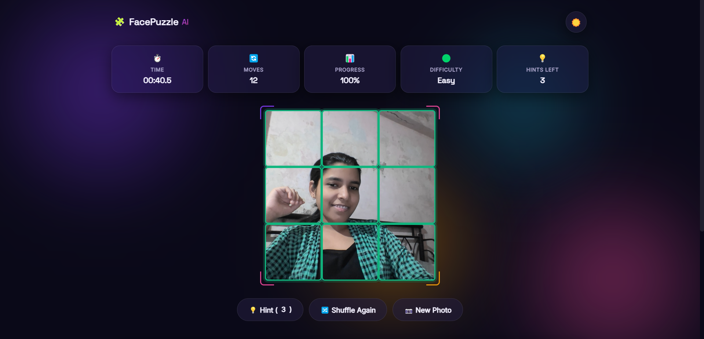

# 🧩 FacePuzzle AI

### 📷 Turn Your Face Into an Interactive Puzzle Game

FacePuzzle AI is a browser-based puzzle game that captures a photo using your device camera and transforms it into a playable sliding-style puzzle. Players can choose different difficulty levels, track their performance, and compete against their own best times through a built-in leaderboard.

## Features

* 📷 Webcam photo capture
* 🧩 Dynamic face puzzle generation
* 🎯 Multiple difficulty levels
  * Easy (3×3)
  * Medium (4×4)
  * Hard (5×5)
      
* 🖱️ Drag and drop interactions
* 📱 Touch support for mobile devices
* ⏱️ Live timer tracking
* 🔄 Move counter
* 📊 Progress tracking
* 💡 Hint system
* 🔀 Shuffle Again functionality
* 🌙 Dark mode support
* 🎉 Confetti celebration on completion
* 🏆 Local leaderboard using localStorage
* 📱 Fully responsive design

## How It Works

1. Enable camera access.
2. Capture a photo or upload an image.
3. Select a difficulty level.
4. The image is automatically divided into puzzle pieces.
5. Rearrange the pieces to reconstruct the original image.
6. Complete the puzzle in the shortest time possible.

## Technologies Used

* HTML5
* CSS3
* JavaScript (ES6+)
* Canvas API
* MediaDevices API (getUserMedia)
* Local Storage API

## 📸 Preview

### Home Page


### Gameplay


### Victory Screen


## Installation

Clone the repository:

```bash
git clone https://github.com/your-username/face-puzzle.git
```

Navigate to the project folder:

```bash
cd face-puzzle
```

Open the application:

```bash
index.html
```

or use a local server.

## Browser Support

* Google Chrome
* Microsoft Edge
* Mozilla Firefox
* Safari

> Camera functionality requires HTTPS or localhost.

## Future Improvements

* Global leaderboard
* Custom image filters
* Additional puzzle modes
* Achievement system
* Multiplayer challenges
* Share results functionality

## Live Demo

**Live URL:** https://face-puzzle-playground.vercel.app

## Author

Prachi Patel
